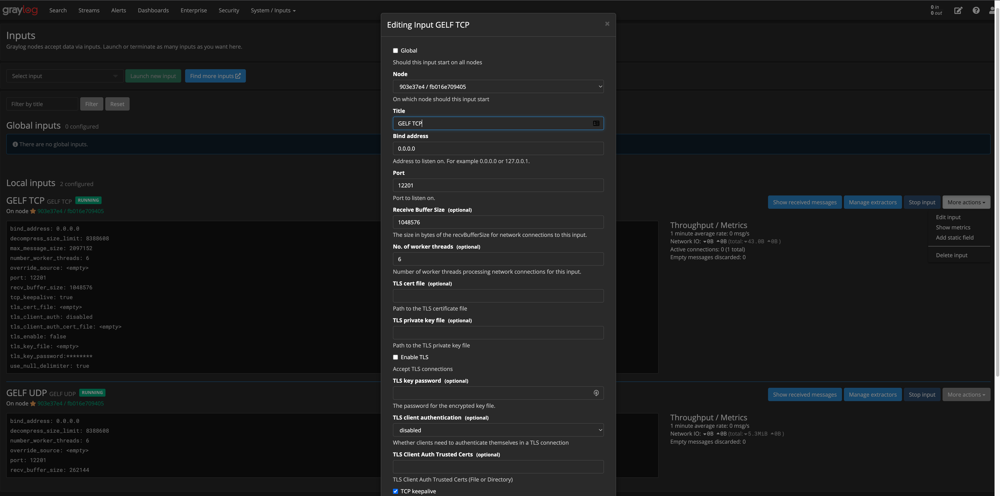
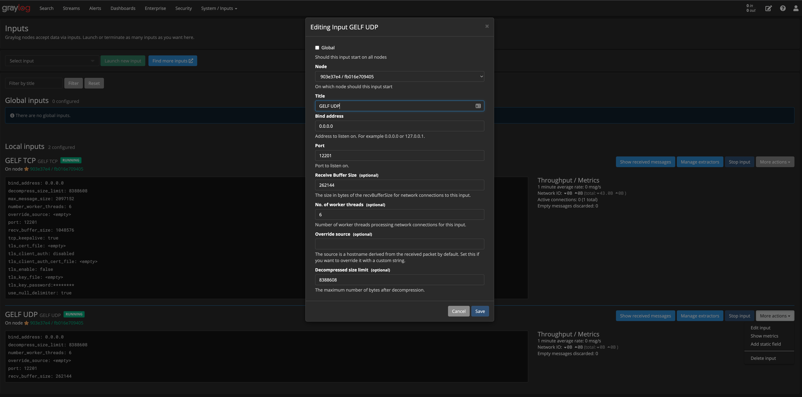

# Logging:
I believe that logs are definitely important for any application. Them help us find out some kind of problem in some scenario. In my application, I choose [logrus](https://github.com/sirupsen/logrus) and [graylog](https://www.graylog.org/). For only one reason for that, I have a bit experience with graylog. :D 

# Demo:
[Graylog](https://graylog.tdo.works/)
```bash
user: anonymous
pass: anonymous
```

# Dependencies
- [logrus](https://github.com/sirupsen/logrus)
- [graylog](https://www.graylog.org/)

# Installation

## Graylog: 

Run with Docker: [docker-compose.yml](../docker-compose.yml)

```bash
docker-compose up -d
```

Create TCP and UDP input:

TCP input: 


UDP input: 


## Logrus:

```bash
go get github.com/sirupsen/logrus
```

## Implementation code
Checkout: [graylog component](../components/log/graylog.go). 

Integration: [main](../packages/rest_api/main.go#L49)

Using in code:
```bash
log.Printf("this is log")
```